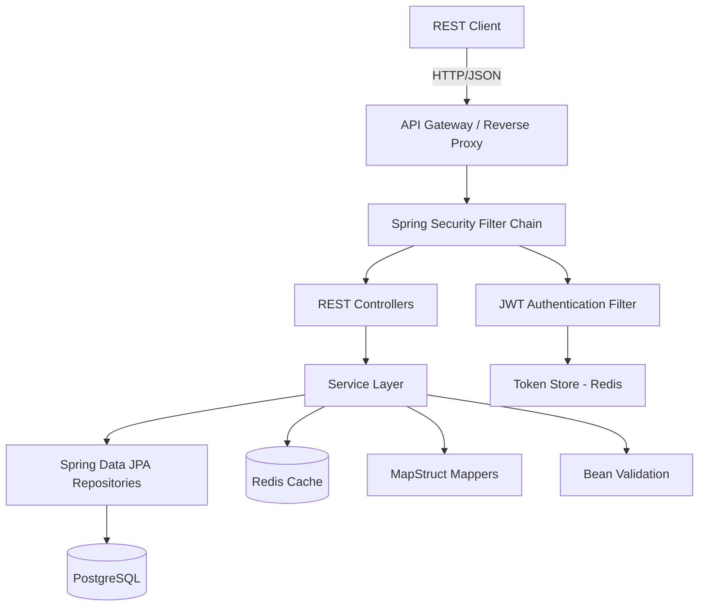
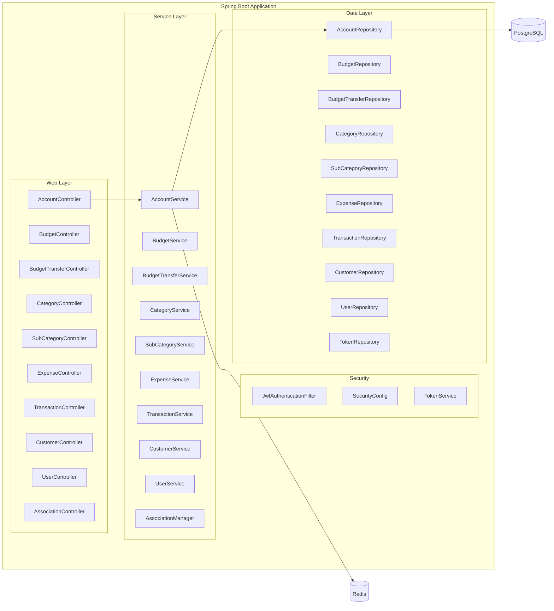
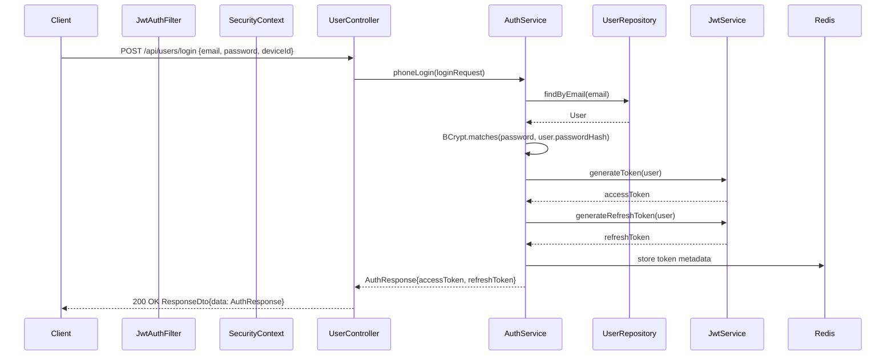
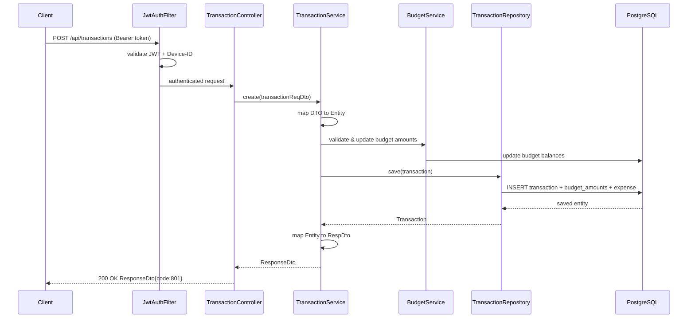
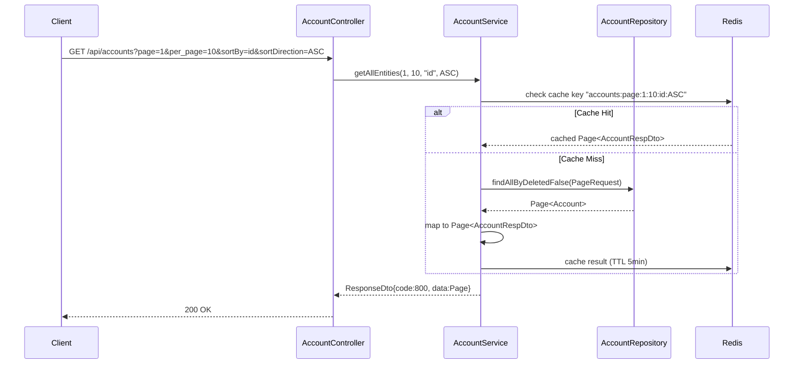

# Design Document: Spring Boot Expenses Tracker

## Overview

This document describes the migration of an existing Jakarta EE (Jersey/GlassFish) expenses tracker application to a modern Spring Boot 3.4.x stack running on Java 21 LTS. The new application preserves the exact same REST API contracts (endpoints, request/response shapes, pagination, and security model) while replacing the underlying infrastructure with Spring Boot auto-configuration, Spring Data JPA with PostgreSQL, Spring Security with JWT, Redis for caching/token management, and externalized YAML configuration.

The architecture follows a layered approach: Controller → Service → Repository, with cross-cutting concerns (security, validation, error handling, auditing) managed by Spring's built-in mechanisms. MapStruct remains for DTO mapping, Lombok for boilerplate reduction, and Redis is introduced for token blacklisting, session caching, and frequently-accessed entity caching.

## Architecture



### High-Level Component Diagram



## Sequence Diagrams

### Authentication Flow



### Create Transaction Flow



### Pagination Flow



## Components and Interfaces

### Component 1: Security Configuration

**Purpose**: Configures Spring Security filter chain with JWT authentication, device-ID validation, role-based authorization, and public endpoint whitelisting.

```java
@Configuration
@EnableWebSecurity
@EnableMethodSecurity
public class SecurityConfig {

    @Bean
    public SecurityFilterChain filterChain(HttpSecurity http,
                                           JwtAuthenticationFilter jwtFilter,
                                           DeviceIdFilter deviceIdFilter) throws Exception;

    @Bean
    public PasswordEncoder passwordEncoder();

    @Bean
    public AuthenticationManager authenticationManager(AuthenticationConfiguration config) throws Exception;
}
```

**Responsibilities**:
- Define public (whitelisted) endpoints that bypass authentication
- Configure JWT filter placement in the filter chain
- Define role-based access rules (ADMIN, CUSTOMER, SHARED)
- Disable CSRF for stateless API
- Configure CORS policy

### Component 2: JWT Authentication Filter

**Purpose**: Intercepts every request, extracts and validates JWT token, sets SecurityContext.

```java
@Component
public class JwtAuthenticationFilter extends OncePerRequestFilter {

    @Override
    protected void doFilterInternal(HttpServletRequest request,
                                    HttpServletResponse response,
                                    FilterChain filterChain) throws ServletException, IOException;

    @Override
    protected boolean shouldNotFilter(HttpServletRequest request);
}
```

**Responsibilities**:
- Extract Bearer token from Authorization header
- Validate token signature and expiration
- Check token revocation status in Redis
- Load UserDetails and set authentication in SecurityContext
- Skip filtering for whitelisted endpoints

### Component 3: Association Manager

**Purpose**: Centralized service for managing many-to-many and one-to-many entity associations across the domain model.

```java
@Service
@Transactional
public class AssociationManager {

    ResponseDto addAssociation(String entityRefNo, EntityType entityType,
                               Set<String> associationRefNos, EntityType associationType);

    ResponseDto removeAssociation(String entityRefNo, EntityType entityType,
                                  Set<String> associationRefNos, EntityType associationType);

    ResponseDto addDtoAssociation(String entityRefNo, EntityType entityType,
                                  Set<?> associationReqDtos, EntityType associationType);
}
```

**Responsibilities**:
- Route association operations to the correct service based on entity type
- Validate entity existence before association modification
- Return detailed success/error maps per reference number
- Maintain transactional integrity across association changes

### Component 4: Base CRUD Service Pattern

**Purpose**: Generic service interface providing standard CRUD + pagination operations.

```java
public interface CrudService<REQ, UPD, ENTITY> {

    ResponseDto create(REQ reqDto);
    ResponseDto get(String refNo);
    Optional<ENTITY> getEntity(String refNo);
    ResponseDto update(String refNo, UPD updateDto);
    ResponseDto delete(String refNo);
    ResponseDto getAllEntities(Long page, Long perPage, String sortBy, SortDirection direction);
    Set<ENTITY> getEntities(Set<String> refNos);
}
```

**Responsibilities**:
- Standardize CRUD operations across all domain services
- Enforce consistent response structure (ResponseDto)
- Provide entity retrieval by reference number (UUID)
- Support paginated listing with configurable sorting

### Component 5: Redis Cache Manager

**Purpose**: Manages caching strategy for entities, pagination results, and token storage.

```java
@Configuration
@EnableCaching
public class RedisConfig {

    @Bean
    public RedisCacheManager cacheManager(RedisConnectionFactory connectionFactory);

    @Bean
    public RedisTemplate<String, Object> redisTemplate(RedisConnectionFactory connectionFactory);
}
```

**Responsibilities**:
- Configure cache TTLs per entity type
- Provide token blacklist storage for logout/revocation
- Cache frequently accessed entities (accounts, categories)
- Invalidate cache on entity mutations

## Data Models

### BaseEntity (MappedSuperclass)

```java
@MappedSuperclass
@Getter
@Setter
@EntityListeners(AuditingEntityListener.class)
public abstract class BaseEntity {

    @Column(nullable = false, unique = true, updatable = false)
    private String refNo = UUID.randomUUID().toString();

    @CreatedDate
    @Column(nullable = false, updatable = false)
    private LocalDateTime createdAt;

    @LastModifiedDate
    @Column(nullable = false)
    private LocalDateTime updatedAt;

    @Column(nullable = false)
    private boolean deleted = false;
}
```

**Validation Rules**:
- refNo is auto-generated UUID, immutable after creation
- createdAt is set once on persist via JPA auditing
- updatedAt is auto-updated on every modification
- deleted flag enables soft-delete pattern

### User Entity

```java
@Entity
@Table(name = "users")
@Getter @Setter @NoArgsConstructor @AllArgsConstructor
public class User extends BaseEntity implements UserDetails {

    @Id
    @GeneratedValue(strategy = GenerationType.IDENTITY)
    private Long id;

    @Column(nullable = false)
    private String fullName;

    @Column(nullable = false, unique = true)
    private String email;

    private int age;

    @Column(nullable = false)
    @JsonIgnore
    private String password;

    private boolean verified = true;
    private boolean loggedIn = false;

    @Column(unique = true)
    private String deviceId;

    @OneToOne(mappedBy = "user", cascade = CascadeType.ALL, fetch = FetchType.LAZY)
    private Customer customer;

    @OneToMany(mappedBy = "user", fetch = FetchType.LAZY, cascade = CascadeType.ALL)
    private List<Token> tokens = new ArrayList<>();

    @ManyToMany(fetch = FetchType.EAGER, cascade = CascadeType.PERSIST)
    @JoinTable(name = "user_roles",
        joinColumns = @JoinColumn(name = "user_id"),
        inverseJoinColumns = @JoinColumn(name = "role_id"))
    private Set<Role> roles = new HashSet<>();
}
```

### Customer Entity

```java
@Entity
@Table(name = "customers")
@Getter @Setter @NoArgsConstructor @AllArgsConstructor
public class Customer extends BaseEntity {

    @Id
    @GeneratedValue(strategy = GenerationType.IDENTITY)
    private Long id;

    @OneToOne(fetch = FetchType.LAZY, cascade = CascadeType.ALL)
    @JoinColumn(name = "user_id")
    private User user;

    @ManyToMany(fetch = FetchType.LAZY)
    @JoinTable(name = "customer_accounts",
        joinColumns = @JoinColumn(name = "customer_id"),
        inverseJoinColumns = @JoinColumn(name = "account_id"))
    private Set<Account> accounts = new HashSet<>();

    @OneToMany(mappedBy = "customer", fetch = FetchType.LAZY, cascade = {CascadeType.PERSIST, CascadeType.MERGE})
    private Set<Budget> budgets = new HashSet<>();

    @ManyToMany(fetch = FetchType.LAZY)
    @JoinTable(name = "customer_categories",
        joinColumns = @JoinColumn(name = "customer_id"),
        inverseJoinColumns = @JoinColumn(name = "category_id"))
    private Set<Category> categories = new HashSet<>();

    @ManyToMany(fetch = FetchType.LAZY)
    @JoinTable(name = "customer_sub_categories",
        joinColumns = @JoinColumn(name = "customer_id"),
        inverseJoinColumns = @JoinColumn(name = "sub_category_id"))
    private Set<SubCategory> subCategories = new HashSet<>();

    @OneToMany(mappedBy = "customer", fetch = FetchType.LAZY, cascade = {CascadeType.PERSIST, CascadeType.MERGE})
    private Set<Expense> expenses = new HashSet<>();

    @OneToMany(mappedBy = "customer", fetch = FetchType.LAZY, cascade = {CascadeType.PERSIST, CascadeType.MERGE})
    private Set<Transaction> transactions = new HashSet<>();

    @OneToMany(mappedBy = "customer", fetch = FetchType.LAZY, cascade = {CascadeType.PERSIST, CascadeType.MERGE})
    private Set<BudgetTransfer> budgetTransfers = new HashSet<>();
}
```

### Account Entity

```java
@Entity
@Table(name = "accounts")
@Getter @Setter @NoArgsConstructor @AllArgsConstructor
public class Account extends BaseEntity {

    @Id
    @GeneratedValue(strategy = GenerationType.IDENTITY)
    private Long id;

    @Column(nullable = false)
    private String name;

    private String details;

    @OneToMany(fetch = FetchType.LAZY, cascade = {CascadeType.PERSIST, CascadeType.MERGE})
    @JoinColumn(name = "account_id")
    private Set<Budget> budgets = new HashSet<>();

    @ManyToMany(mappedBy = "accounts", fetch = FetchType.LAZY)
    @JsonIgnore
    private Set<Customer> customers = new HashSet<>();
}
```

### Budget Entity

```java
@Entity
@Table(name = "budgets")
@Getter @Setter @NoArgsConstructor @AllArgsConstructor
public class Budget extends BaseEntity {

    @Id
    @GeneratedValue(strategy = GenerationType.IDENTITY)
    private Long id;

    @Column(nullable = false)
    private String name;

    private String details;
    private Double amount;

    @Enumerated(EnumType.STRING)
    private BudgetType budgetType;

    private boolean defaultReceiver = false;
    private boolean defaultSender = false;

    @ManyToOne(fetch = FetchType.LAZY)
    @JoinColumn(name = "customer_id")
    @JsonIgnore
    private Customer customer;

    @ManyToOne(fetch = FetchType.LAZY)
    @JoinColumn(name = "account_id")
    @JsonIgnore
    private Account account;
}

public enum BudgetType {
    ENTERTAINMENT, SAVINGS, BILLS, ALLOWANCE, MOM, MISC, DONATION, EXTERNAL, DEFAULT
}
```

### Transaction Entity

```java
@Entity
@Table(name = "transactions")
@Getter @Setter @NoArgsConstructor @AllArgsConstructor
public class Transaction extends BaseEntity {

    @Id
    @GeneratedValue(strategy = GenerationType.IDENTITY)
    private Long id;

    private String name;
    private String details;
    private Double amount;

    @OneToMany(fetch = FetchType.LAZY, cascade = {CascadeType.PERSIST, CascadeType.MERGE}, orphanRemoval = true)
    @JoinColumn(name = "transaction_id")
    private Set<BudgetAmount> budgetAmounts = new HashSet<>();

    @ManyToOne(fetch = FetchType.LAZY, optional = false)
    @JoinColumn(name = "customer_id")
    @JsonIgnore
    private Customer customer;

    @OneToOne(cascade = {CascadeType.PERSIST, CascadeType.MERGE}, orphanRemoval = true)
    @JoinColumn(name = "expense_id")
    private Expense expense;
}
```

### BudgetTransfer Entity

```java
@Entity
@Table(name = "budget_transfers")
@Getter @Setter @NoArgsConstructor @AllArgsConstructor
public class BudgetTransfer extends BaseEntity {

    @Id
    @GeneratedValue(strategy = GenerationType.IDENTITY)
    private Long id;

    private String name;
    private String details;
    private Double amount;
    private boolean lending = false;

    @ManyToOne(fetch = FetchType.LAZY, optional = false)
    @JoinColumn(name = "customer_id")
    @JsonIgnore
    private Customer customer;

    @OneToOne(fetch = FetchType.EAGER, cascade = {CascadeType.PERSIST, CascadeType.MERGE}, orphanRemoval = true)
    @JoinColumn(name = "sender_budget_amount_id")
    private BudgetAmount senderBudgetAmount;

    @OneToMany(fetch = FetchType.LAZY, cascade = {CascadeType.PERSIST, CascadeType.MERGE}, orphanRemoval = true)
    @JoinColumn(name = "budget_transfer_id")
    private Set<BudgetAmount> receiverBudgetAmounts = new HashSet<>();
}
```

### BudgetAmount Entity

```java
@Entity
@Table(name = "budget_amounts")
@Getter @Setter @NoArgsConstructor @AllArgsConstructor
public class BudgetAmount extends BaseEntity {

    @Id
    @GeneratedValue(strategy = GenerationType.IDENTITY)
    private Long id;

    @ManyToOne(fetch = FetchType.LAZY)
    @JoinColumn(name = "budget_id")
    private Budget budget;

    private Double amount;
    private boolean trans;

    @ManyToOne(fetch = FetchType.LAZY)
    @JoinColumn(name = "transaction_id")
    @JsonIgnore
    private Transaction transaction;

    @Enumerated(EnumType.STRING)
    private AmountType amountType;
}

public enum AmountType {
    DEBIT, CREDIT
}
```

### ResponseDto (Unified Response)

```java
@Data
@NoArgsConstructor
@AllArgsConstructor
@Builder
@JsonInclude(JsonInclude.Include.NON_NULL)
public class ResponseDto {

    private String message;
    private boolean status;
    private int code;
    private Object data;

    @Builder.Default
    @JsonFormat(shape = JsonFormat.Shape.STRING, pattern = "yyyy-MM-dd HH:mm:ss")
    private LocalDateTime date = LocalDateTime.now();
}
```

**Response Codes**:
- 800: Fetch successful
- 801: Create successful
- 802: Update successful
- 804: Error
- 805: Delete successful
- 810: Authentication/Authorization error


## Key Functions with Formal Specifications

### Function 1: JwtService.generateToken()

```java
public String generateToken(User user, Map<String, Object> extraClaims, long expirationMs)
```

**Preconditions:**
- `user` is non-null with valid email (username)
- `extraClaims` is non-null (may be empty map)
- `expirationMs > 0`
- JWT signing key is configured and available

**Postconditions:**
- Returns a valid JWT string that can be parsed back
- Token contains subject = user.getEmail()
- Token contains all entries from extraClaims
- Token expiration = current time + expirationMs
- Token is signed with the configured secret key

**Loop Invariants:** N/A

### Function 2: AssociationManager.addAssociation()

```java
public ResponseDto addAssociation(String entityRefNo, EntityType entityType,
                                  Set<String> associationRefNos, EntityType associationType)
```

**Preconditions:**
- `entityRefNo` is non-null (or null only when entityType == CUSTOMER, in which case current user's customer is used)
- `entityType` is a valid EntityType enum value
- `associationRefNos` is non-null and non-empty
- `associationType` is a valid EntityType enum value
- The entity identified by entityRefNo exists and is not soft-deleted

**Postconditions:**
- For each refNo in associationRefNos:
  - If association entity exists and is not already associated → added to collection, recorded in success map
  - If association entity exists but already associated → recorded in error map
  - If association entity does not exist → recorded in error map
- Parent entity is persisted with updated associations
- Returns ResponseDto with code 802 containing AssociationResponse{success, error}

**Loop Invariants:**
- After processing refNo[i], all refNo[0..i] have been categorized into either success or error map
- The entity's association collection size increases by exactly |success map entries|

### Function 3: AccountService.getAllEntities()

```java
public ResponseDto getAllEntities(Long pageNumber, Long pageSize, String sortBy, SortDirection sortDirection)
```

**Preconditions:**
- `pageNumber >= 1` (1-based pagination)
- `pageSize >= 1`
- `sortBy` is a valid field name on the entity (defaults to "id" if invalid)
- `sortDirection` is ASC or DESC

**Postconditions:**
- Returns ResponseDto with code 800
- data contains Page object with: content (list of DTOs), pageNumber, pageSize, totalElements, totalPages, hasNext, hasPrevious
- content.size() <= pageSize
- Only non-deleted entities are included
- Results are ordered by sortBy in sortDirection order

**Loop Invariants:** N/A (delegated to Spring Data)

### Function 4: AuthService.phoneLogin()

```java
public ResponseDto phoneLogin(LoginRequest loginRequest)
```

**Preconditions:**
- `loginRequest.email` is non-null and non-blank
- `loginRequest.password` is non-null and non-blank
- `loginRequest.deviceId` is non-null and non-blank

**Postconditions:**
- If user exists AND password matches AND user is verified AND not deleted:
  - Returns ResponseDto with code 801
  - data contains {accessToken, refreshToken, user details}
  - User's loggedIn flag is set to true
  - User's deviceId is updated
  - Previous tokens for user are revoked
  - New tokens are persisted
- If user not found OR password mismatch OR not verified:
  - Throws appropriate exception (mapped to ResponseDto with code 810)

**Loop Invariants:** N/A

### Function 5: TransactionService.create()

```java
public ResponseDto create(TransactionReqDto transactionReqDto)
```

**Preconditions:**
- `transactionReqDto` passes bean validation
- `transactionReqDto.budgetAmounts` is non-empty
- `transactionReqDto.expense` is non-null
- Current authenticated user has ROLE_CUSTOMER
- All referenced budget refNos exist and belong to the current customer

**Postconditions:**
- Transaction entity is persisted with generated refNo
- Associated Expense entity is persisted (cascade)
- All BudgetAmount entities are persisted (cascade)
- Each referenced Budget's amount is adjusted:
  - DEBIT: budget.amount -= budgetAmount.amount
  - CREDIT: budget.amount += budgetAmount.amount
- Transaction is added to customer's transactions collection
- Returns ResponseDto with code 801, data = TransactionRespDto
- Redis cache for customer's transactions is invalidated

**Loop Invariants:**
- For each budgetAmount processed: the corresponding budget's amount reflects the cumulative adjustments

## Algorithmic Pseudocode

### Security Filter Chain Algorithm

```java
// Spring Security Filter Chain Processing
ALGORITHM processSecurityFilterChain(request, response)
INPUT: HttpServletRequest request, HttpServletResponse response
OUTPUT: SecurityContext with authenticated user OR error response

BEGIN
    path = request.getRequestURI()
    method = request.getMethod()

    // Step 1: Check whitelist
    IF isWhitelisted(path, method) THEN
        RETURN proceed without authentication
    END IF

    // Step 2: Extract Authorization header
    authHeader = request.getHeader("Authorization")
    IF authHeader == null OR NOT authHeader.startsWith("Bearer ") THEN
        RETURN 401 Unauthorized ResponseDto{code: 810}
    END IF

    // Step 3: Validate JWT
    jwt = authHeader.substring(7)
    username = jwtService.extractUsername(jwt)
    IF username == null THEN
        RETURN 401 Unauthorized
    END IF

    // Step 4: Load user and validate token
    user = userDetailsService.loadUserByUsername(username)
    isTokenValid = redis.get("token:" + jwt) != "revoked"
    IF NOT jwtService.isTokenValid(jwt, user) OR NOT isTokenValid THEN
        RETURN 401 Unauthorized
    END IF

    // Step 5: Validate Device-ID
    deviceId = request.getHeader("Device-ID")
    IF deviceId != user.getDeviceId() THEN
        RETURN 400 Bad Request "device id mismatch"
    END IF

    // Step 6: Authorization check
    IF isAdminApi(path, method) AND NOT user.hasRole("ROLE_ADMIN") THEN
        RETURN 403 Forbidden
    END IF
    IF isCustomerApi(path, method) AND NOT user.hasRole("ROLE_CUSTOMER") THEN
        RETURN 403 Forbidden
    END IF

    // Step 7: Set security context
    SecurityContextHolder.setAuthentication(user)
    RETURN proceed to controller
END
```

### Association Management Algorithm

```java
ALGORITHM addAssociation(entityRefNo, entityType, associationRefNos, associationType)
INPUT: entityRefNo (String), entityType (EntityType), associationRefNos (Set<String>), associationType (EntityType)
OUTPUT: ResponseDto with AssociationResponse

BEGIN
    // Step 1: Resolve parent entity
    IF entityRefNo == null AND entityType == CUSTOMER THEN
        entityRefNo = getCurrentAuthenticatedUser().getCustomer().getRefNo()
    END IF

    service = serviceRegistry.get(entityType)
    ASSERT service != null : "No service for entity type"

    entity = service.getEntity(entityRefNo)
    IF entity.isEmpty() THEN
        THROW GeneralFailureException("entity not found")
    END IF

    // Step 2: Get association handler
    collectionAdder = adderRegistry.get(associationType)
    ASSERT collectionAdder != null

    // Step 3: Process each association
    successMap = new HashMap()
    errorMap = new HashMap()

    FOR EACH refNo IN associationRefNos DO
        // INVARIANT: |successMap| + |errorMap| == number of processed refNos
        associationOpt = collectionAdder.getEntity(refNo)
        IF associationOpt.isEmpty() THEN
            errorMap.put(refNo, "no entity corresponds to this ref no")
            CONTINUE
        END IF

        collection = getAssociationCollection(entity, associationType)
        IF collection.contains(associationOpt.get()) THEN
            errorMap.put(refNo, "entity already contains this association")
        ELSE
            collection.add(associationOpt.get())
            successMap.put(refNo, "was added successfully")
        END IF
    END FOR

    // Step 4: Persist and return
    service.save(entity)
    invalidateCache(entityType, entityRefNo)

    RETURN ResponseDto{code: 802, data: AssociationResponse{success: successMap, error: errorMap}}
END
```

### Pagination Algorithm

```java
ALGORITHM getAllEntitiesPaginated(pageNumber, pageSize, sortBy, sortDirection)
INPUT: pageNumber (Long, 1-based), pageSize (Long), sortBy (String), sortDirection (SortDirection)
OUTPUT: ResponseDto containing Page<RespDto>

BEGIN
    // Step 1: Validate and normalize input
    ASSERT pageNumber >= 1
    ASSERT pageSize >= 1

    IF NOT isValidField(sortBy, entityClass) THEN
        sortBy = "id"
    END IF

    // Step 2: Check Redis cache
    cacheKey = entityName + ":page:" + pageNumber + ":" + pageSize + ":" + sortBy + ":" + sortDirection
    cached = redis.get(cacheKey)
    IF cached != null THEN
        RETURN ResponseDto{code: 800, data: cached}
    END IF

    // Step 3: Build Spring Data PageRequest (0-based)
    sort = Sort.by(sortDirection == ASC ? Sort.Direction.ASC : Sort.Direction.DESC, sortBy)
    pageRequest = PageRequest.of(pageNumber.intValue() - 1, pageSize.intValue(), sort)

    // Step 4: Query database
    entityPage = repository.findAllByDeletedFalse(pageRequest)

    // Step 5: Map to DTOs
    dtoPage = Page{
        content: mapper.entitiesToDtos(entityPage.getContent()),
        pageNumber: pageNumber,
        pageSize: pageSize,
        totalElements: entityPage.getTotalElements(),
        totalPages: entityPage.getTotalPages(),
        hasNext: entityPage.hasNext(),
        hasPrevious: entityPage.hasPrevious()
    }

    // Step 6: Cache and return
    redis.set(cacheKey, dtoPage, TTL = 5 minutes)
    RETURN ResponseDto{code: 800, data: dtoPage}
END
```

## Example Usage

### Application YAML Configuration

```yaml
spring:
  application:
    name: expenses-tracker

  datasource:
    url: ${DB_URL:jdbc:postgresql://localhost:5432/expenses}
    username: ${DB_USERNAME:expenses_user}
    password: ${DB_PASSWORD:expenses_pass}
    driver-class-name: org.postgresql.Driver
    hikari:
      maximum-pool-size: ${DB_POOL_SIZE:20}
      minimum-idle: ${DB_MIN_IDLE:5}
      connection-timeout: ${DB_CONNECTION_TIMEOUT:30000}

  jpa:
    hibernate:
      ddl-auto: ${JPA_DDL_AUTO:update}
    show-sql: ${JPA_SHOW_SQL:false}
    properties:
      hibernate:
        dialect: org.hibernate.dialect.PostgreSQLDialect
        format_sql: true
    open-in-view: false

  data:
    redis:
      host: ${REDIS_HOST:localhost}
      port: ${REDIS_PORT:6379}
      password: ${REDIS_PASSWORD:}
      timeout: ${REDIS_TIMEOUT:2000}

  jackson:
    serialization:
      write-dates-as-timestamps: false
    date-format: "yyyy-MM-dd HH:mm:ss"
    default-property-inclusion: non_null

server:
  port: ${SERVER_PORT:8080}
  servlet:
    context-path: /expenses-tracker

app:
  security:
    jwt:
      secret-key: ${JWT_SECRET_KEY:your-256-bit-secret-key-here}
      access-token-expiration: ${JWT_ACCESS_EXPIRATION:86400000}
      refresh-token-expiration: ${JWT_REFRESH_EXPIRATION:604800000}
    device-id-header: Device-ID
    whitelist:
      - path: /api/users/register
        method: POST
      - path: /api/users/login
        method: POST
      - path: /api/users/refreshToken
        method: POST
      - path: /api/users/resetAccount
        method: POST
      - path: /api/users/changeEmail
        method: PUT
      - path: /api/users/validateChangeEmail
        method: PUT
      - path: /api/users/activate/**
        method: PUT
      - path: /api/customers
        method: POST
      - path: /api/otp/**
        method: "*"

  cache:
    default-ttl: ${CACHE_DEFAULT_TTL:300}
    entity-ttls:
      accounts: ${CACHE_ACCOUNTS_TTL:300}
      categories: ${CACHE_CATEGORIES_TTL:600}
      budgets: ${CACHE_BUDGETS_TTL:120}
```

### Controller Example (AccountController)

```java
@RestController
@RequestMapping("/api/accounts")
@RequiredArgsConstructor
@Slf4j
public class AccountController {

    private final AccountService accountService;

    @PostMapping
    public ResponseEntity<ResponseDto> createAccount(@Valid @RequestBody AccountReqDto request) {
        return ResponseEntity.ok(accountService.create(request));
    }

    @GetMapping("/refNo/{refNo}")
    public ResponseEntity<ResponseDto> getAccount(@PathVariable String refNo) {
        return ResponseEntity.ok(accountService.get(refNo));
    }

    @GetMapping("/name/{name}")
    public ResponseEntity<ResponseDto> getAccountByName(@PathVariable String name) {
        return ResponseEntity.ok(accountService.getAccountByName(name));
    }

    @GetMapping("/{refNo}/budgets")
    public ResponseEntity<ResponseDto> getAccountBudgets(@PathVariable String refNo) {
        return ResponseEntity.ok(accountService.getAccountBudgets(refNo));
    }

    @PutMapping("/{refNo}")
    public ResponseEntity<ResponseDto> updateAccount(@PathVariable String refNo,
                                                     @Valid @RequestBody AccountUpdateDto request) {
        return ResponseEntity.ok(accountService.update(refNo, request));
    }

    @DeleteMapping("/{refNo}")
    public ResponseEntity<ResponseDto> deleteAccount(@PathVariable String refNo) {
        return ResponseEntity.ok(accountService.delete(refNo));
    }

    @GetMapping
    public ResponseEntity<ResponseDto> getAllAccounts(
            @RequestParam(defaultValue = "1") Long page,
            @RequestParam(name = "per_page", defaultValue = "10") Long perPage,
            @RequestParam(defaultValue = "id") String sortBy,
            @RequestParam(required = false) String sortDirection) {
        SortDirection direction = SortDirection.fromString(sortDirection);
        return ResponseEntity.ok(accountService.getAllEntities(page, perPage, sortBy, direction));
    }

    @PutMapping("/addAssociation/{accountRefNo}/{budgetRefNo}")
    public ResponseEntity<ResponseDto> addAssociation(@PathVariable String accountRefNo,
                                                      @PathVariable String budgetRefNo) {
        return ResponseEntity.ok(accountService.addAssociation(accountRefNo, budgetRefNo));
    }

    @PutMapping("/removeAssociation/{accountRefNo}/{budgetRefNo}")
    public ResponseEntity<ResponseDto> removeAssociation(@PathVariable String accountRefNo,
                                                         @PathVariable String budgetRefNo) {
        return ResponseEntity.ok(accountService.removeAssociation(accountRefNo, budgetRefNo));
    }
}
```

### Repository Example

```java
@Repository
public interface AccountRepository extends JpaRepository<Account, Long> {

    Optional<Account> findByRefNoAndDeletedFalse(String refNo);

    List<Account> findByNameContainingIgnoreCaseAndDeletedFalse(String name);

    Page<Account> findAllByDeletedFalse(Pageable pageable);

    @Query("SELECT a FROM Account a WHERE a.refNo IN :refNos AND a.deleted = false")
    Set<Account> findAllByRefNoIn(@Param("refNos") Set<String> refNos);

    @Query("SELECT a FROM Account a WHERE a.name = 'default account' AND a.deleted = false")
    Optional<Account> findDefaultAccount();
}
```

### Service Implementation Example

```java
@Service
@RequiredArgsConstructor
@Transactional
@Slf4j
public class AccountServiceImpl implements AccountService {

    private final AccountRepository accountRepository;
    private final AccountMapper accountMapper;
    private final BudgetService budgetService;

    @Override
    @CacheEvict(value = "accounts", allEntries = true)
    public ResponseDto create(AccountReqDto reqDto) {
        Account account = accountMapper.reqDtoToEntity(reqDto);
        Account saved = accountRepository.save(account);
        log.info("Created account {}", saved.getRefNo());
        return ResponseDtoBuilder.getCreateResponse("Account", saved.getRefNo(),
                accountMapper.entityToRespDto(saved));
    }

    @Override
    @Cacheable(value = "accounts", key = "#refNo")
    public ResponseDto get(String refNo) {
        Account account = accountRepository.findByRefNoAndDeletedFalse(refNo)
                .orElseThrow(() -> new ObjectNotFoundException(
                        String.format("Account with ref %s not found", refNo)));
        return ResponseDtoBuilder.getFetchResponse("Account", refNo,
                accountMapper.entityToRespDto(account));
    }

    @Override
    public ResponseDto getAllEntities(Long page, Long perPage, String sortBy, SortDirection direction) {
        PageRequest pageRequest = PageRequest.of(
                page.intValue() - 1, perPage.intValue(),
                Sort.by(direction == SortDirection.ASC ? Sort.Direction.ASC : Sort.Direction.DESC, sortBy));
        Page<Account> accountPage = accountRepository.findAllByDeletedFalse(pageRequest);
        Page<AccountRespDto> dtoPage = accountMapper.entityPageToRespDtoPage(accountPage);
        return ResponseDtoBuilder.getFetchAllResponse("Account", dtoPage);
    }

    @Override
    @CacheEvict(value = "accounts", allEntries = true)
    public ResponseDto delete(String refNo) {
        Account account = accountRepository.findByRefNoAndDeletedFalse(refNo)
                .orElseThrow(() -> new ObjectNotFoundException("Account not found"));
        account.setDeleted(true);
        accountRepository.save(account);
        return ResponseDtoBuilder.getDeleteResponse("Account", refNo);
    }
}
```

## Correctness Properties

*A property is a characteristic or behavior that should hold true across all valid executions of a system—essentially, a formal statement about what the system should do. Properties serve as the bridge between human-readable specifications and machine-verifiable correctness guarantees.*

### Property 1: Valid token grants authentication

*For any* valid, non-expired, non-revoked JWT token and matching Device-ID, the JWT filter SHALL set the authenticated user in the SecurityContext and allow the request to proceed.

**Validates: Requirements 1.3, 2.2**

### Property 2: Revoked token denies access

*For any* token that has been revoked in Redis (via logout or new login), the JWT filter SHALL reject any subsequent request using that token with code 810, regardless of the token's signature validity or expiration status.

**Validates: Requirements 1.5, 5.1, 5.2**

### Property 3: Whitelisted endpoints bypass authentication

*For any* request targeting a whitelisted endpoint (as defined in YAML configuration), the JWT filter SHALL skip authentication validation and allow the request to proceed without a token.

**Validates: Requirements 1.4**

### Property 4: Device-ID mismatch denies access

*For any* authenticated request where the Device-ID header value does not equal the user's registered deviceId, the JWT filter SHALL reject the request with code 810. Conversely, a matching Device-ID SHALL allow the request to proceed.

**Validates: Requirements 2.1, 2.2**

### Property 5: Role-based access control

*For any* user and endpoint combination, access SHALL be granted if and only if the user possesses the required role (or a higher role in the hierarchy where ROLE_ADMIN > ROLE_CUSTOMER). A user with insufficient role SHALL receive code 810.

**Validates: Requirements 3.1, 3.2, 3.3**

### Property 6: Login revokes previous tokens

*For any* successful user login, all previously issued tokens for that user SHALL be revoked, ensuring that no prior token grants access after the new login.

**Validates: Requirements 4.4**

### Property 7: Login updates user state

*For any* successful login, the user's deviceId SHALL be updated to the provided value and the loggedIn flag SHALL be set to true.

**Validates: Requirements 4.5**

### Property 8: JWT token round-trip

*For any* user, generating a JWT token and then extracting claims from it SHALL yield the original user's email as subject, all configured extra claims, and an expiration time equal to creation time plus the configured expiration duration.

**Validates: Requirements 6.1, 6.2**

### Property 9: Entity CRUD round-trip

*For any* valid entity creation request, creating the entity and then fetching it by its returned refNo SHALL produce a response DTO equivalent to the original request data (with system-generated fields added).

**Validates: Requirements 7.1, 7.2**

### Property 10: Soft-delete exclusion

*For any* entity that has been soft-deleted (deleted flag = true), that entity SHALL NOT appear in any standard query results including get-by-refNo, list-all, and paginated queries.

**Validates: Requirements 7.5, 7.6, 16.1, 16.2**

### Property 11: Pagination page size invariant

*For any* paginated list request with per_page = n, the returned content list SHALL have size less than or equal to n.

**Validates: Requirements 8.2**

### Property 12: Invalid sort field defaults to id

*For any* paginated list request where sortBy specifies a field name that does not exist on the entity, the system SHALL default to sorting by "id" without error.

**Validates: Requirements 8.3**

### Property 13: Association addition idempotency

*For any* entity and association refNo that is already present in the entity's collection, attempting to add it again SHALL result in the refNo appearing in the error map with the collection size unchanged.

**Validates: Requirements 9.2**

### Property 14: Non-existent association refNo goes to error map

*For any* add-association request containing a refNo that does not correspond to any existing entity, that refNo SHALL appear in the error map with message "no entity corresponds to this ref no".

**Validates: Requirements 9.3**

### Property 15: Transaction budget balance adjustment

*For any* transaction with budget amounts, each budget amount with AmountType DEBIT SHALL decrease the corresponding budget's balance by that amount, and each budget amount with AmountType CREDIT SHALL increase the corresponding budget's balance by that amount.

**Validates: Requirements 10.2, 10.3**

### Property 16: Budget transfer conservation

*For any* budget transfer, the total amount debited from the sender budget SHALL equal the sum of amounts credited to all receiver budgets, preserving the total money in the system.

**Validates: Requirements 11.2**

### Property 17: RefNo uniqueness and immutability

*For any* N entity creations of the same type, all generated refNos SHALL be distinct UUID-format strings. Furthermore, for any entity, the refNo SHALL remain unchanged across any number of updates.

**Validates: Requirements 15.3, 19.1, 19.2, 19.3**

### Property 18: Entity timestamp consistency

*For any* newly created entity, createdAt SHALL equal updatedAt at the time of first persist. For any subsequent update, updatedAt SHALL be greater than or equal to the previous updatedAt while createdAt remains unchanged.

**Validates: Requirements 15.1, 15.2**

### Property 19: ResponseDto null field exclusion

*For any* ResponseDto serialized to JSON, fields with null values SHALL NOT appear in the JSON output.

**Validates: Requirements 13.4**

### Property 20: Error responses do not expose internals

*For any* unexpected exception handled by the Global Exception Handler, the response SHALL contain a generic error message without exposing stack traces, class names, or internal implementation details.

**Validates: Requirements 14.4**

### Property 21: DTO mapping does not expose sensitive data

*For any* entity-to-response-DTO conversion, the resulting DTO SHALL NOT contain database primary keys (Long id), password hashes, or other sensitive internal fields.

**Validates: Requirements 20.2**

### Property 22: Request DTO mapping preserves system fields

*For any* request-DTO-to-entity conversion, system-managed fields (refNo, createdAt, updatedAt, deleted) SHALL NOT be overwritten by values from the request DTO.

**Validates: Requirements 20.3**

## Error Handling

### Error Scenario 1: Entity Not Found

**Condition**: GET/PUT/DELETE request with a refNo that doesn't exist or is soft-deleted
**Response**: ResponseDto with code 804, data = ResponseError{errorCategory: DATABASE_Error, errorCode: "DB_001", errorMessage: "entity with ref X not found"}
**Recovery**: Client retries with correct refNo or creates the entity first

### Error Scenario 2: Authentication Failure

**Condition**: Missing/invalid/expired JWT token, or revoked token
**Response**: ResponseDto with code 810, data = ResponseError{errorCategory: BusinessError, errorMessage: "token is expired/invalid"}
**Recovery**: Client obtains new token via /api/users/login or /api/users/refreshToken

### Error Scenario 3: Authorization Failure

**Condition**: User with ROLE_CUSTOMER accessing ADMIN_APIS, or vice versa
**Response**: ResponseDto with code 810, data = ResponseError{errorMessage: "you are not authorized"}
**Recovery**: Client uses appropriate role credentials

### Error Scenario 4: Validation Failure

**Condition**: Request body fails Jakarta Bean Validation constraints
**Response**: ResponseDto with code 804, data = list of field-level validation errors
**Recovery**: Client corrects request body per validation messages

### Error Scenario 5: Device-ID Mismatch

**Condition**: Device-ID header doesn't match user's registered deviceId
**Response**: ResponseDto with code 810, data = ResponseError{errorMessage: "device id mismatch"}
**Recovery**: Client uses correct device or re-registers device via login

### Error Scenario 6: Duplicate Association

**Condition**: Attempting to add an association that already exists
**Response**: ResponseDto with code 802, data = AssociationResponse with error map entry for that refNo
**Recovery**: No action needed; association already exists

### Global Exception Handler

```java
@RestControllerAdvice
public class GlobalExceptionHandler {

    @ExceptionHandler(ObjectNotFoundException.class)
    public ResponseEntity<ResponseDto> handleNotFound(ObjectNotFoundException ex);

    @ExceptionHandler(MethodArgumentNotValidException.class)
    public ResponseEntity<ResponseDto> handleValidation(MethodArgumentNotValidException ex);

    @ExceptionHandler(AccessDeniedException.class)
    public ResponseEntity<ResponseDto> handleAccessDenied(AccessDeniedException ex);

    @ExceptionHandler(GeneralFailureException.class)
    public ResponseEntity<ResponseDto> handleGeneralFailure(GeneralFailureException ex);

    @ExceptionHandler(Exception.class)
    public ResponseEntity<ResponseDto> handleGeneric(Exception ex);
}
```

## Testing Strategy

### Unit Testing Approach

- **Framework**: JUnit 5 + Mockito
- **Coverage Target**: 80%+ for service layer, 90%+ for utility classes
- **Key Test Cases**:
  - Service CRUD operations with mocked repositories
  - JWT token generation and validation
  - Association manager routing logic
  - Pagination boundary conditions (page 0, empty results, last page)
  - Soft-delete behavior verification
  - MapStruct mapper correctness

### Property-Based Testing Approach

- **Library**: jqwik (Java property-based testing)
- **Properties to Test**:
  - Pagination: ∀ valid page/size params → response.content.size() <= size
  - RefNo uniqueness: ∀ N entity creations → all refNos are distinct
  - Association idempotency: adding same refNo twice → second attempt in error map
  - Sort correctness: ∀ sorted page → elements are in declared order

### Integration Testing Approach

- **Framework**: Spring Boot Test + Testcontainers (PostgreSQL + Redis)
- **Scope**:
  - Full request lifecycle tests (controller → service → repository → DB)
  - Security filter chain integration (whitelist, JWT, roles)
  - Redis caching behavior (cache hit/miss/invalidation)
  - Transaction rollback on failure
  - Association cascade operations

## Performance Considerations

- **Connection Pooling**: HikariCP with configurable pool size (default 20)
- **Redis Caching**: Entity pages cached with 5-minute TTL; individual entities cached on read
- **Lazy Loading**: All collections use FetchType.LAZY to avoid N+1 queries
- **Batch Operations**: Spring Data's `saveAll()` for bulk association updates
- **Index Strategy**: Database indexes on refNo, email, name columns for fast lookups
- **Pagination**: Database-level pagination via LIMIT/OFFSET (Spring Data Pageable)
- **Token Validation**: Redis-based token lookup (O(1)) instead of database query

## Security Considerations

- **Password Storage**: BCrypt with strength 12
- **JWT Signing**: HMAC-SHA256 with externalized secret key (minimum 256-bit)
- **Token Revocation**: Redis-based blacklist checked on every authenticated request
- **Device Binding**: Device-ID header validated against user's registered device
- **Role Hierarchy**: ROLE_ADMIN > ROLE_CUSTOMER for shared endpoints
- **Input Validation**: Jakarta Bean Validation on all request DTOs
- **SQL Injection Prevention**: Spring Data JPA parameterized queries exclusively
- **CORS**: Configurable allowed origins via YAML
- **Soft Delete**: No physical deletion of data; audit trail preserved

## Dependencies

| Dependency | Version | Purpose |
|---|---|---|
| Spring Boot Starter Web | 3.4.x | REST controllers, embedded Tomcat |
| Spring Boot Starter Data JPA | 3.4.x | JPA repositories, Hibernate 6.x |
| Spring Boot Starter Security | 3.4.x | Authentication & authorization |
| Spring Boot Starter Data Redis | 3.4.x | Redis caching & token store |
| Spring Boot Starter Validation | 3.4.x | Bean validation |
| Spring Boot Starter Cache | 3.4.x | Cache abstraction |
| Spring Boot Starter Actuator | 3.4.x | Health checks, metrics |
| PostgreSQL Driver | 42.7.x | PostgreSQL JDBC driver |
| jjwt-api / jjwt-impl / jjwt-jackson | 0.12.x | JWT creation & validation |
| MapStruct | 1.6.x | DTO ↔ Entity mapping |
| Lombok | 1.18.x | Boilerplate reduction |
| Springdoc OpenAPI | 2.7.x | API documentation (Swagger UI) |
| Testcontainers | 1.20.x | Integration test containers |
| jqwik | 1.9.x | Property-based testing |
